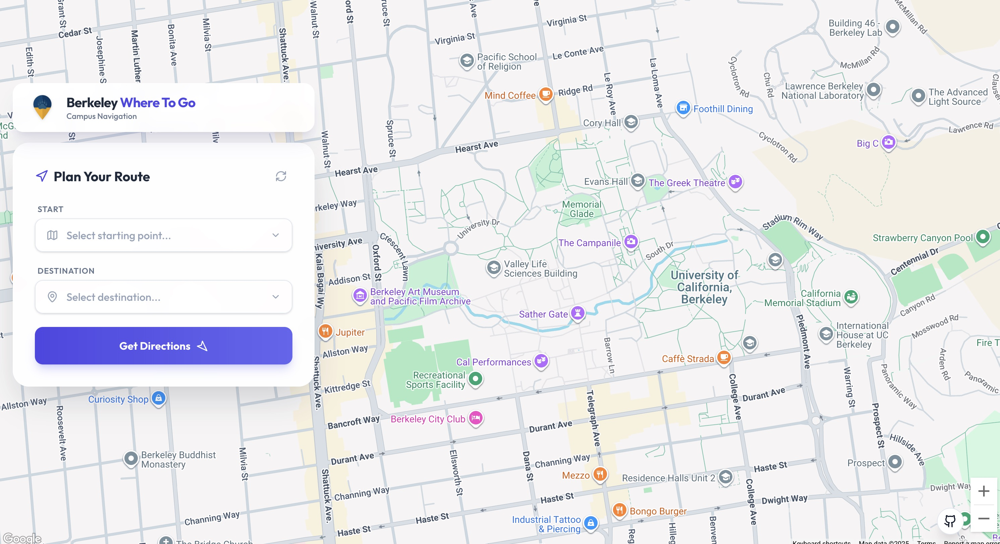
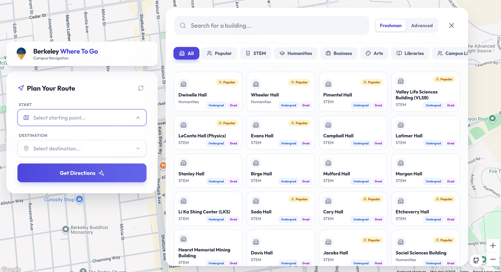
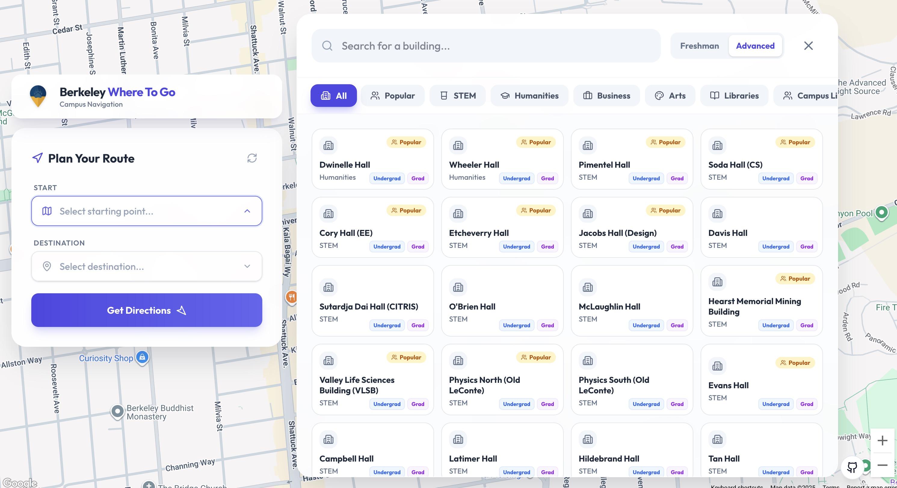
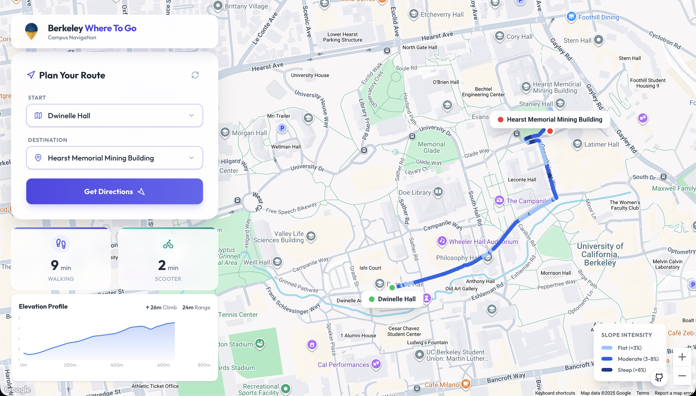
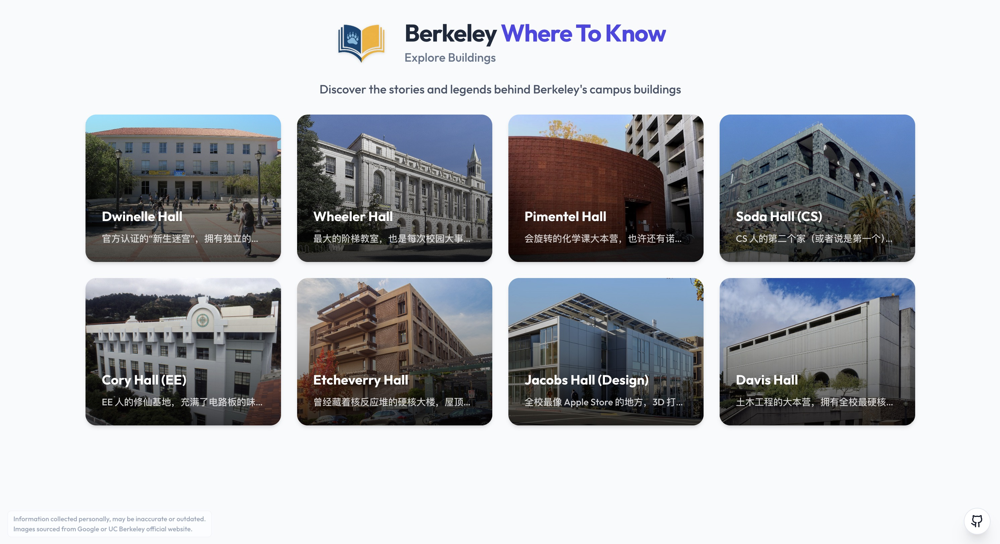

# 🎓 Berkeley Where To

[🇨🇳 中文版](README_zh.md)

<div align="center">

**Intelligent Campus Companion for UC Berkeley Students: Go & Know**

[](https://reactjs.org/)
[](https://vitejs.dev/)
[](https://tailwindcss.com/)
[](https://developers.google.com/maps)

"Where To Go" helps you plan routes and arrive on time.
"Where To Know" helps you discover the stories behind the buildings.

### [🚀 Try App Online](https://berkeleywhereto.vercel.app)

</div>

---

## 📸 Feature Preview

### 👋 Welcome Interface



### 👶 Freshman Mode Selection



### 🎓 Advanced Mode Selection



### 🗺️ Static Route Display



### 🚶 Dynamic Navigation


### 🔄 Mode Switching


### 📖 Where To Know Interface



### 🏛️ Building Details


---

## 💡 Inspiration

As a freshman selecting courses, I often faced a dilemma: **"Is it safe to schedule these two classes back-to-back?"**

Even with the famous 10-minute "Berkeley Time," rushing from one end of campus to the other can be stressful. I created this project to help you **visualize and estimate commute times** between buildings.

But campus life isn't just about rushing to class. It's also about understanding the history and legends around us. That's why this project has evolved into **Berkeley Where To**:

- **Where To Go**: Your smart navigation assistant.
- **Where To Know**: Your guide to campus stories and secrets.

---

## ✨ Core Features

### 🚀 Where To Go: Smart Navigation

- **Deep Google Maps Integration** - Accurate route planning based on real geographic data
- **Slope-Colored Routes** - Route colors change dynamically based on steepness
  - 🔵 **Light Blue**: Flat Route (< 3% slope)
  - 🔵 **Medium Blue**: Moderate Slope (3-8% slope)
  - 🔵 **Dark Blue**: Steep Slope (> 8% slope)
- **Smart Route Markers** - Elegant start/end markers showing full building names
- **Dynamic Marker Positioning** - Markers auto-adjust to avoid obscuring routes
- **One-Click Reset** - Instantly clear map data with smooth fade-out animations

### 📖 Where To Know: Campus Stories

- **Rich Building Stories** - Discover the history, fun facts, and legends of campus buildings
- **Markdown Rendering** - Beautifully formatted text with clickable links to external resources
- **Interactive Gallery** - High-quality images of campus landmarks
- **Student Survival Tips** - Practical advice from seniors for each location
- **Smart Sorting & Filtering** - Sort and filter buildings by familiarity, category, or popularity
- **Photo Spots** - Find the best angles for your Instagram shots
- **Global Multi-language Support** - Seamlessly switch between Chinese and English across all site content
- **Smart Asset Preloading** - Optimized resource loading order, significantly boosting performance during mode transitions
- **Advanced Interaction Animations** - Smooth transitions for list sorting and dynamic linkage between the Header and Logo

### 📊 Elevation Analysis

- **Interactive Elevation Profile** - Real-time display of route terrain changes
- **Climb Statistics** - Shows total elevation gain and range
- **Slope Legend** - Clear slope grade indicators on map

### 🏢 Smart Building Selector

- **Dual Selection Modes** - Tailored for different needs:
  - 👶 **Freshman Mode**: Curated list of 39 essential buildings for new students
  - 🎓 **Advanced Mode**: Complete database of 139 campus locations
- **Full-Screen Floating Panel** - Modern building selection interface floating over map
- **Real-Time Search** - Instant building name search filtering
- **Category Browsing** - Comprehensive categorization:
  - 📚 **Academic**: STEM, Humanities, Arts, Business, Libraries
  - 🏠 **Campus Life**: Housing, Dining, Athletics, Student Centers
  - 🔬 **Research**: LBNL, Institutes, Labs
  - 🏛️ **Admin & Landmarks**: Sproul, Campanile, etc.
- **Grid Layout Display** - All buildings at a glance (Currently PC Only)
- **Smart Interactions** - Support ESC to close, click to toggle, and more

### 🏛️ Building Database

Covers **139 campus buildings** (Advanced Mode), including:

- **Academic Halls**: Dwinelle, Wheeler, Pimentel, VLSB, Evans
- **Engineering**: Soda, Cory, Etcheverry, Jacobs, Hearst Mining
- **Professional Schools**: Haas, Berkeley Law, Optometry
- **Libraries**: Moffitt, Doe, Grimes, East Asian, Bancroft
- **Housing**: Units 1-3, Blackwell, Foothill, Clark Kerr, I-House
- **Athletics**: Memorial Stadium, RSF, Haas Pavilion
- **Research**: LBNL, Space Sciences Lab
- **Landmarks**: Sather Gate, The Campanile

### ⏱️ Precise Time Calculation

- **Multiple Transportation Modes**:

  - 🚶‍♂️ **Walking Time** - Based on real routes and terrain
  - 🛴 **Scooter/Bike** - Fast travel option (~1/4 of walking time)

- **Real-Time API Calculation** - Accurate estimates via Google Maps Directions API

### 🎨 Modern UI Design

- **Glassmorphism Effects** - Elegant blurred backgrounds
- **Smooth Animations** - Silky interactions powered by Framer Motion
- **Responsive Design** - Perfect for desktop, tablet, and mobile

- **Floating Panel Design** - All UI elements with shadow effects, clear hierarchy
- **GitHub Integration** - Quick access to source code via the floating GitHub button

---

## 🚀 Quick Start

### Prerequisites

- **Node.js** 18.x or higher
- **Google Maps API Key** with the following APIs enabled:
  - Maps JavaScript API
  - Places API
  - Directions API
  - Elevation API

### Installation

```bash
# 1. Clone the repository
git clone <your-repo-url>
cd berkeley-where-to-go

# 2. Install dependencies
npm install

# 3. Configure environment variables
# Create .env file and add your Google Maps API Key
echo "VITE_GOOGLE_MAPS_API_KEY=your_api_key_here" > .env

# 4. Start development server
npm run dev

# 5. Open in browser
# Usually at http://localhost:5173
```

### Production Build

```bash
# Build for production
npm run build

# Preview production build
npm run preview
```

---

## 📖 Usage Guide

### 🚀 Where To Go: Navigation Mode

1. **Select Start Location**

   - Click "Start" input
   - Floating selection panel appears on the right
   - Use search or categories to find building
   - Click to select, panel closes automatically

2. **Select Destination**

   - Click "Destination" input
   - Select destination in the same way

3. **Get Route**

   - Click "Get Directions" button
   - Wait for route calculation (usually < 2s)

4. **View Results**

   - 🗺️ Map shows slope-coded route
   - ⏱️ Left side shows walking and scooter times
   - 📊 Bottom shows elevation profile
   - 🏷️ View slope legend

### 📖 Where To Know: Discovery Mode

1. **Switch Mode**

   - Hover over the Logo area in the top left
   - Click the "Where To Know" option to switch to Discovery Mode

2. **Browse Buildings**

   - Browse the beautiful grid of building cards
   - Scroll to explore more campus buildings

3. **View Details**

   - Click on any building card to view details
   - 📜 Read building summary and history
   - 👻 Discover campus legends and fun facts
   - 💡 Get survival tips from seniors
   - 📸 Find the best photo spots

4. **Return to Navigation (Where To Go)**

   - Hover over the Logo area in the top left again
   - Click the "Where To Go" option to switch back to Navigation Mode

---

## 🏗️ Project Structure

```
berkeley-where-to-go/
├── src/
│   ├── components/                    # 🧩 React Components
│   │   ├── building/                 # 🏢 Building-related components (Grid, Detail)
│   │   ├── common/                   # 🛠️ Common UI components
│   │   ├── Header.jsx                # 🧭 Page header & navigation
│   │   ├── RouteInput.jsx            # ✏️ Route input form
│   │   ├── BuildingSelect.jsx        # 🏢 Building input component
│   │   ├── BuildingSelectionPanel.jsx # 🪟 Building selection panel
│   │   ├── MapContainer.jsx          # 🗺️ Map container & route rendering
│   │   ├── TravelTimeDisplay.jsx     # ⏱️ Travel time display
│   │   ├── ElevationChart.jsx        # 📊 Elevation profile chart
│   │   └── BuildingInfo.jsx          # ℹ️ Building details & stories (Deprecated)
│   ├── views/                         # 🖼️ Page-level components
│   │   ├── LandingPage.jsx           # 👋 Landing Page
│   │   ├── NavigationPage.jsx        # 🚀 Navigation Page (Go)
│   │   └── InfoPage.jsx              # 📖 Information Page (Know)
│   ├── locales/                       # 🌍 Internationalization bundles
│   │   ├── zh.js                     # 🇨🇳 Chinese
│   │   └── en.js                     # 🇺🇸 English
│   ├── context/                       # 💡 Global state management
│   ├── data/                          # 📊 Static data files
│   ├── hooks/                         # ⚓ Custom Hooks
│   ├── App.jsx                       # ⚛️ Main app component
│   ├── main.jsx                      # 🚪 App entry point
│   └── index.css                     # 🎨 Global styles
├── public/                           # 📦 Static assets
├── .env                              # 🔐 Environment variables
├── package.json                      # 📦 Project dependencies
├── vite.config.js                   # ⚡️ Vite configuration
├── tailwind.config.js               # 🌬️ Tailwind configuration
└── README.md                        # 📖 Project documentation
```

---

## 🛠️ Tech Stack

### Core Frameworks

-  - Latest React framework with concurrency support
-  - Fast development build tool
-  - Modern utility-first CSS framework

### UI & Animations

-  - High-performance animation library
-  - Beautiful icon library
-  - React data visualization library

### Map Services

-  - Google Maps React integration
-  - Map display
-  - Route planning
-  - Elevation data fetching

### Development Tools

-  - Code quality assurance
-  - CSS processing and compatibility

---

## 🎯 Use Cases

### 👶 Freshmen Orientation

- Quickly get familiar with campus geography
- Estimate distance from dorm to class
- Plan routes for the first week

### 📅 Course Planning

- Evaluate inter-class transition time when choosing classes
- Avoid back-to-back classes that are too far apart
- Optimize daily schedule

### 🏃 Daily Commute

- Choose fastest/flattest route
- Decide between walking or biking/scooting
- Understand physical effort of the route

### 🎉 Event Participation

- Quickly find event locations
- Plan route from dorm/parking
- Provide navigation for visitors

### 👻 Campus Exploration (Where To Know)

- **History Hunter**: Uncover centuries of history and mysterious legends
- **Photo Spots**: Find the best angles for your social media
- **Survival Guide**: Get practical tips and advice from seniors

---

## 🌍 Deployment Options

### Recommended Platforms

**Vercel** (Recommended) ⭐

```bash
# One-click deployment
npm install -g vercel
vercel
```

**Netlify**

```bash
# Simply drag and drop dist/ folder
npm run build
```

**GitHub Pages**

```bash
# Build and push to gh-pages branch
npm run build
# Deploy dist/ content to GitHub Pages
```

### Environment Variables

When deploying to production, ensure `VITE_GOOGLE_MAPS_API_KEY` is configured in platform settings.

---

## 📊 Performance Metrics

| Metric                 | Value           |
| ---------------------- | --------------- |
| Initial Load Time      | < 3s            |
| Route Calculation Time | < 2s            |
| Elevation Data Fetch   | < 1s            |
| Mobile Compatibility   | 🚧 In Progress  |
| Responsive Layout      | 🖥️ Desktop Only |
| PWA Support            | 🔄 Extensible   |

---

## 🗺️ Roadmap

### ✅ Completed

- [x] Google Maps Core Integration
- [x] 100+ Buildings Database (Advanced Mode)
- [x] Smart Building Selection Panel (Categories, Search)
- [x] Route Planning and Time Calculation
- [x] Elevation Data and Slope Visualization
- [x] Modern UI Design & Animations
- [x] Custom Map Markers
- [x] One-Click Reset
- [x] Where To Know Campus Stories
- [x] Markdown Text Rendering
- [x] GitHub Repository Link
- [x] Know Interface Language Switch

### 🚧 Planned

- [ ] Mobile Support
- [ ] Dark Mode
- [ ] PWA Offline Support
- [ ] User Comments and Suggestions

---

## 🤝 Contributing

Issues and Pull Requests are welcome!

### Contribution Workflow

1. **Fork this repository**
2. **Create feature branch**
   ```bash
   git checkout -b feature/AmazingFeature
   ```
3. **Commit changes**
   ```bash
   git commit -m 'Add some AmazingFeature'
   ```
4. **Push to branch**
   ```bash
   git push origin feature/AmazingFeature
   ```
5. **Open Pull Request**

---

## 📝 Changelog

### v1.5.0 (2025-12)

- ✨ **Site-wide I18n** - Implemented full English and Chinese support, including map markers and building details
- ✨ **Asset Preloading** - Introduced preloading for critical images and animations to eliminate stutters during mode transitions
- ✨ **Performance Boost** - Optimized Framer Motion animations and React component memoization
- ✨ **Structural Refactoring** - Separated pages into a dedicated `views` directory and established a `locales` architecture
- ✨ **Animation Enhancements** - Added slide effects for building grid sorting and refined Header scroll interaction

### v1.4.0 (2025-11)

- ✨ **Project Renamed** - Officially "Berkeley Where To" with dual "Go" & "Know" modes
- ✨ **Where To Know** - New section for discovering building stories and legends
- ✨ **Markdown Support** - Rich text rendering for building descriptions
- ✨ **GitHub Link** - Quick access to repository from the UI

### v1.3.0 (2025-11)

- ✨ **One-Click Reset** - Instantly clear routes with smooth fade-out animation
- ✨ **Enhanced Header** - Refined view switching and animations
- 🐛 **Bug Fixes** - Resolved map focus and route clearing issues

### v1.2.0 (2025-11)

- ✨ **Advanced Mode** - Complete campus database with over 100 buildings
- ✨ **Dual Selection System** - Switch between Freshman and Advanced views
- ✨ **New Categories** - Added Housing, Athletics, Research, and more
- ✨ **Brand Identity** - New logo and visual refinements

### v1.1.0 (2025-11)

- ✨ New Building Selector UI - Floating Panel Design
- ✨ Building Category System - 8 Categories
- ✨ Real-time Search
- ✨ Grid Layout for All Buildings
- ✨ ESC Shortcut and Smart Interactions
- 🐛 Fixed marker obscuring route issue
- 💄 UI Hierarchy Optimization and Shadow Effects

### v1.0.0 (2025-11)

- ✨ Integrated Google Elevation API
- ✨ Elevation Profile Chart
- ✨ Slope Color-Coded Routes
- ✨ Custom Map Marker System
- ✨ Upgraded to React 19
- ✨ Framer Motion Animations
- ✨ Recharts Integration

### v0.1.0 (Initial)

- Basic Route Planning
- Simple Map Display
- Time Calculation

---

## 📄 License

This project is licensed under the **MIT License** - see the [LICENSE](LICENSE) file for details

---

## 🙏 Acknowledgments

- **UC Berkeley** - Campus data and inspiration
- **Google Maps Platform** - Powerful map and geo services
- **React Community** - Excellent open source tools and libraries
- **All Contributors** - Thanks to every developer who improved this project

---

<div align="center">

**Made with ❤️ for UC Berkeley Students**

🐻 _Go Bears!_ 🐻

> "Helping every Berkeley student arrive on time, no more worrying about inter-class transition times!"

[🐛 Report Issue](https://github.com/your-repo/issues) · [✨ Feature Request](https://github.com/your-repo/issues) · [📖 Documentation](https://github.com/your-repo/wiki)

</div>
